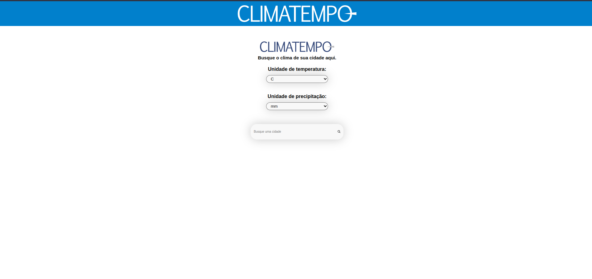
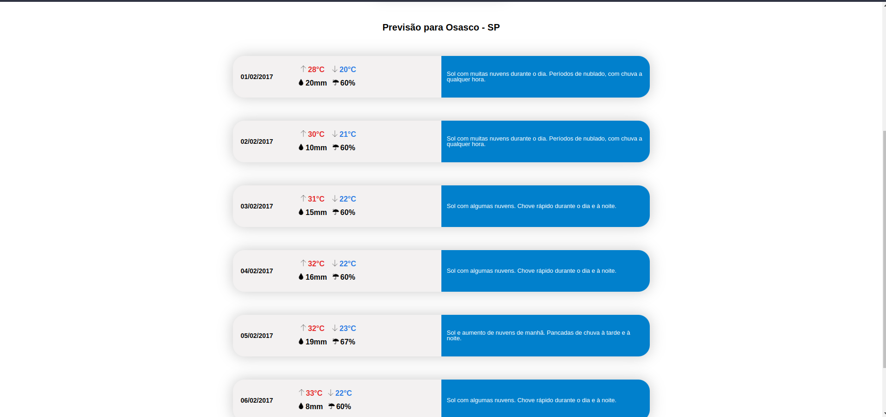

# Challenge Accepted

Pagina Home:




Previsão:




### **Rodando localmente**

Para execultar este APP e API você precisa ter configurado:

- [NodeJS](http://nodejs.org/)
- [Yarn](https://yarnpkg.com/lang/en/docs/cli/install/)

A aplicação foi desenvolvida com NodeJS no Backend e React no Frontend.


```bash
# Clone o repositório do projeto
$ git clone https://github.com/joaoneto-hub/challenge-accepted.git
```

Para rodar o front-end localmente, basta executar o seguinte comando na raíz da pasta front:

```bash
yarn dev
```
ou

```bash
npm run dev 
```

Para rodar o Back-end localmente, basta executar o seguinte comando na raíz da pasta api:

```bash
yarn dev
```
ou
```bash
npm run dev 
```


## Tecnologias

**Frontend:**

- [React](https://reactjs.org/)
- [Axios](https://github.com/axios/axios)

No Front-end Para construir a aplicação de modo responsivo, utilizei o FlexBox do CSS.


**Backend:**

- [Node.js](https://nodejs.org/en/)
- [Express](https://expressjs.com/pt-br/)
